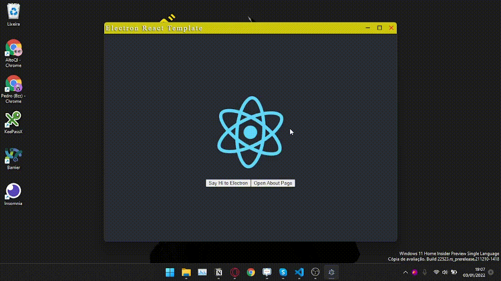

# Electron React Template

This template uses Create React App, Electron and Electron Builder to make a simple but expandable application. It uses React Router to Manage the routes and Styled Components to create components with embedded CSS.

Some Built-In Features:

- **Navigation Bar:**
    
    Custom Navigation Bar that can move, minimize, maximize and close the main window.
    
    
    
- **Easy to create new** **Windows (Including Transparent):**
    
    Using the "openWindow" event (Example in src/modules/Home), you can easily manage how your window will open, using BrowserSettings, and which page will open. For example, if you want to create a transparent window, you can do the following:
    
    ```tsx
    const options: Electron.BrowserWindowConstructorOptions = {
      height: 125,
      width: 200,
      transparent: true,
      frame: false,
      resizable: false,
      alwaysOnTop: true,
    };
    const windowURL = "about";
    window.electron.ipcRenderer.send(
      "openWindow",
      options,
      windowURL,
    );
    ```
    

### Recommended File Structure

This is my favorite React File Structure. Any new feature will follow this structure

```
├─┬ electron # Main Electron Folder
│ ├── main.ts # Main Electron File
│ ├── preload.ts # This script exposes the ipcRenderer to the main window
│ └── tsconfig.json
├── package.json
├─┬ public
├─┬ src
│ ├── App.tsx
│ ├── index.tsx
│ ├─┬ common # Every common files goes here, based on their category
│ │ ├─┬ components
│ │ ├─┬ interfaces
│ │ ├─┬ styles
│ ├─┬ modules # Every module should go here
│ │ ├─┬ Module1 # A module has its own isolated components.
│ │ │ ├─┬ components
│ │ │ ├─┬ interfaces
│ │ │ ├─┬ styles
│ │ │ ├── index.tsx # This is the "page"
│ │ ├─┬ Module2
│ │ ├─┬ Module3
│ └─┬ tests # Tests should go here
├── tsconfig.json
```

### Npm Scripts

**`npm run electron:dev`** or  **`yarn electron:dev`**: Turn on the dev server. Any changes to the React Front End will automatically be displayed in the Electron window. Any changes to the Electron file will close the window and reopen with the new changes.

**`npm run electron:build`** or **`yarn electron:build`**: Builds the app. It will be packed to the /dist folder.